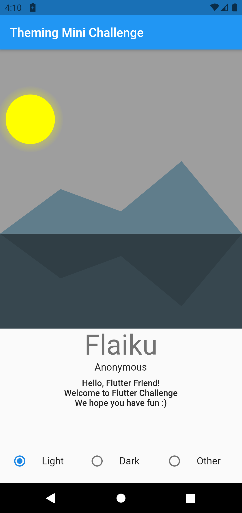

## Welcome to Flutter Challenge!

You are participating in our very first Challenge. We decided to start out small, with a Mini Challenge. This should not take you more than 1-2 hours to complete, and you have 4 days to submit it. The submission deadline is April 16th 23:59:59 UTC.

This Mini Challenge is a bit special since it is our very first one. 

We envision a normal Challenge going like this: we would use community votes to determine the Challenge winners. These winners would then be notified here on the site, and also be featured here for a time (unless they opt out).  The winners receive bragging rights, honor to their house, and profile badges here. Mostly, we hope you come away from a Challenge having learned something new :)

However, since this is our very first Challenge, it is a bit special. So, Real Humans will evaluate each submission and determine the winners. Next, we are partnering with the Flutteristas for this launch. So, winners will be declared at the first-ever Flutteristas Conference on April 17th!

In addition to the glory, the winners of our inaugural Challenge will receive some awesome Real Prizes. This is thanks to the AMAZING, GENEROUS Flutteristas Conference sponsors. On the table is a Dash, 2 copies of the [Complete Flutter Reference](https://fluttercompletereference.com/), and 5 copies of Andrea Bizzotto's [Flutter and Firebase](https://www.udemy.com/course/flutter-firebase-build-a-complete-app-for-ios-android/) course. You can read more details about this [here](https://flutteristas.org/activities-and-prizes/).

We can't promise Real Prizes normally, unless more sponsors contact us [(ahem)](mailto:flutter.challenge.team@gmail.com). But, we sincerely hope you will learn something useful and new each time you participate.

Enough of that. On to why you're really here!

## The Mini Challenge

The theme of today's Mini-Challenge is… theming (ba dum tss). 

Many apps today include not just a custom theme, but often also a separate light-mode theme and a dark-mode theme. So, this Mini Challenge is about taking the sample [starter app](https://github.com/Flutter-Challenge/mini_challenge_1_starter_app/) and making it shine with your own custom themes.

The app is just one screen. Notably, it has a CustomPaint widget showing a simple picture on it. Below the picture is some text. Finally, there is a radio switch for toggling between dark, light and a third theme.

Your Challenge is to make this screen more interesting with custom themeing. A completed challenge app includes:
- a custom TextTheme in the app's ThemeData for light and dark modes. (check out my_theme.dart to get started on this)
- a custom color for the AppBar and the text area's background for light and dark modes (again, check out my_theme.dart to get started on this).
- a custom Widget theme for the CustomPaint widget for light and dark modes (check out custom_themes.dart to get started on this)]
- Not required, but encouraged: theming, as above, for the third theme as well. 

That's it! Good luck :)  
